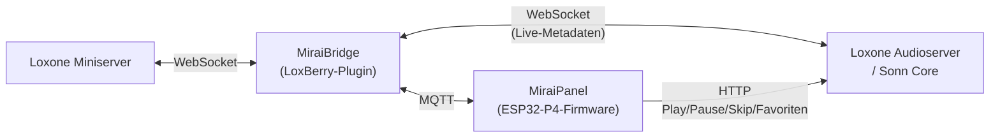

  <picture>
    <source media="(prefers-color-scheme: dark)" srcset="assets/logo-dark.svg">
    
  </picture>

<strong>Control. Sense. One device.</strong>

Der universelle Raumcontroller für deine Loxone-Hausautomation: ein
5,5″-Farbdisplay, acht austauschbare Sensortasten und eine volle
Sensor-Ausstattung — verbunden über LAN/WLAN und MQTT.

  

Dieses Repo ist die **Projektübersicht** — der eigentliche Code liegt in den
verlinkten Teilprojekten unten. 📄 [Flyer (PDF)](assets/MiraiPanel-Flyer.pdf)

## Was das Gerät macht

Du gehst am Panel vorbei — es merkt das von selbst und wacht auf, ganz ohne
Wischen oder Antippen. Läuft gerade Musik, siehst du direkt Cover, Titel und
kannst pausieren oder überspringen, ohne zum Handy zu greifen. Sonst zeigt
es eine ruhige Uhr, bis du wieder etwas brauchst.

Ein Fingertipp genügt, um Licht, Jalousien oder die Heizung im Raum zu
steuern — die Bedienelemente entstehen automatisch aus deiner
Loxone-Struktur, du musst nichts von Hand verdrahten. Die acht
Sensortasten daneben lassen sich pro Raum frei belegen und beschriften,
zusätzlich zum Touchscreen.

Im Hintergrund misst das Panel laufend Raumklima, Licht und Bewegung und
gibt diese Werte über MQTT weiter — offen für Loxone, aber genauso nutzbar
mit Home Assistant, ioBroker oder jeder anderen MQTT-Umgebung. Eingerichtet
wird alles über eine Weboberfläche direkt am Gerät, Updates kommen
over-the-air.

## Screenshots

  
  
  
  

### Web-Konfiguration

Eingerichtet wird das Panel über eine Weboberfläche, die direkt am Gerät
läuft — inklusive visuellem Layout-Editor mit Live-Vorschau und einem
Status-Dashboard mit Echtzeitwerten.

  
  
  

## Architektur

Die MiraiBridge liest beim Start/bei jeder Änderung die komplette
Miniserver-Struktur (`LoxAPP3.json`) und leitet daraus automatisch alle
benötigten MQTT-Topics pro konfiguriertem Baustein ab — keine Topics von
Hand eintragen. Für Audio hält die Bridge zusätzlich eine eigene
WebSocket-Verbindung zum Audioserver/Sonn Core für latenzarme
Titel/Cover/Lautstärke-Updates, die sie per MQTT ans Panel weiterreicht. Nur
für aktive Befehle (Play/Pause/Skip, Favoriten laden) spricht das Panel den
Audioserver direkt per HTTP an, an der Bridge vorbei.

## Teilprojekte

| Repo | Inhalt |
|---|---|
| [MiraiPanel-LCD](https://github.com/Holzmusik/MiraiPanel-LCD) | Firmware (ESPHome/ESP-IDF) für das ESP32-P4-Panel selbst — Display/LVGL-UI, Sensoren, Touch, Audio, Web-Konfiguration *(Quellcode folgt, noch in Test/Entwicklung)* |
| [LoxBerry-Plugin-MiraiBridge](https://github.com/Holzmusik/LoxBerry-Plugin-MiraiBridge) | "MiraiBridge" — LoxBerry-Plugin, verbindet Loxone Miniserver per MQTT mit dem Panel |
| [MiraiPanel-Hardware](https://github.com/Holzmusik/MiraiPanel-Hardware) | Fertigungsdaten für PCB und Gehäuse (Gerber/STEP/DXF) — noch im Aufbau |

## Hardware

Eigene PCB (Basis + Sensor-/Touch-Module) und Gehäuse, siehe
[MiraiPanel-Hardware](https://github.com/Holzmusik/MiraiPanel-Hardware).
Montage freistehend, wandmontiert, oder nachgerüstet auf dem bestehenden
Sockel eines Lichtschalters (kompakte Variante) — integrierte, unsichtbare
Kabelführung.

  
  

  

## Technische Daten

| Kategorie | Merkmal | Details |
|---|---|---|
| **Display & Bedienung** | Display | 5,5″ Farb-LCD, Touch, 1280×720 px |
| | Sensortasten | 8× kapazitiv, einstellbare Empfindlichkeit, individuell beschriftbar & pro Raum austauschbar |
| | Näherung | ToF-Sensor + PIR wecken das Display bei Annäherung |
| | Feedback | konfigurierbare Tastentöne |
| | UI | Light-/Dark-Theme, wählbare Akzentfarbe |
| **Sensoren** | Raumklima | Temperatur/Feuchte, CO₂/VOC/Luftqualität |
| | Bewegung | PIR-Sensor |
| | Präsenz | Mikrofon mit einstellbarer Schwelle |
| | Licht | Umgebungslichtsensor |
| | Versorgung | Spannungs-/Strommessung |
| **Konnektivität** | Netzwerk | LAN 10/100, automatisches Failover auf WLAN |
| | Protokoll | MQTT — offene Schnittstelle für jede MQTT-Umgebung |
| | Loxone | LoxBerry-Plugin (MiraiBridge) für direkte Integration |
| | Auch nutzbar mit | Home Assistant, ioBroker und jedem MQTT-Broker |
| **Stromversorgung** | Versorgung | extern 10–30 V DC, 24 V nominal |
| | Verbrauch | ca. 1,8 W bei aktivem Display |
| | Sleep-Modus | aktivierbar, automatisches Wecken bei aktuellen Sensorwerten, Dauer konfigurierbar |
| **Konfiguration** | Einrichtung | vollständig über Web-Oberfläche am Gerät konfigurierbar |
| | Updates | Firmware-Updates over-the-air |
| **Gehäuse** | Montage | freistehend, wandmontiert, oder nachgerüstet auf bestehendem Lichtschalter-Sockel |
| | Materialien | eloxiertes Aluminium, Edelstahl, 3D-gedrucktes Kunststoff, Glas |

---

MiraiPanel ist ein unabhängiges Projekt und steht in keiner Verbindung
zu oder Unterstützung durch Loxone Electronics GmbH. Loxone ist eine
Marke der Loxone Electronics GmbH.
