

  <picture>
    <source media="(prefers-color-scheme: dark)" srcset="assets/logo-dark.svg">
    
  </picture>

<strong>Control. Sense. One device.</strong>

Der universelle Raumcontroller für deine Loxone-Hausautomation: ein
5,5″-Farbdisplay, acht austauschbare Sensortasten und eine volle
Sensor-Ausstattung — verbunden über LAN/WLAN und MQTT.

  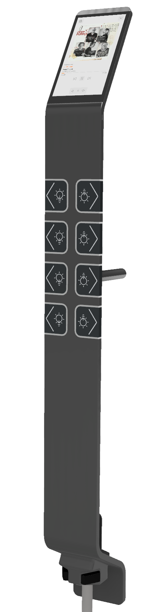

Dieses Repo ist die **Projektübersicht** — der eigentliche Code liegt in den
verlinkten Teilprojekten unten. 📄 [Flyer (PDF)](assets/MiraiPanel-Flyer.pdf)

## Was das Gerät macht

Du gehst am Panel vorbei — es merkt das von selbst und wacht auf, ganz ohne
Wischen oder Antippen. Läuft gerade Musik, siehst du direkt Cover, Titel und
kannst pausieren oder überspringen, ohne zum Handy zu greifen. Sonst zeigt
es eine ruhige Uhr, bis du wieder etwas brauchst.

Ein Fingertipp genügt, um Licht, Jalousien oder die Heizung im Raum zu
steuern — die Bedienelemente entstehen automatisch aus deiner
Loxone-Struktur, du musst nichts von Hand verdrahten. Die acht
Sensortasten daneben lassen sich pro Raum frei belegen und beschriften,
zusätzlich zum Touchscreen.

Im Hintergrund misst das Panel laufend Raumklima, Licht und Bewegung und
gibt diese Werte über MQTT weiter — offen für Loxone, aber genauso nutzbar
mit Home Assistant, ioBroker oder jeder anderen MQTT-Umgebung. Eingerichtet
wird alles über eine Weboberfläche direkt am Gerät, Updates kommen
over-the-air.

## Screenshots

  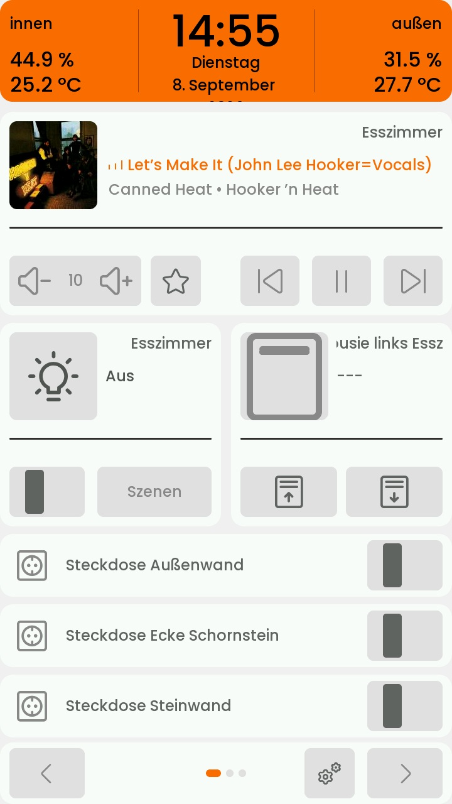
  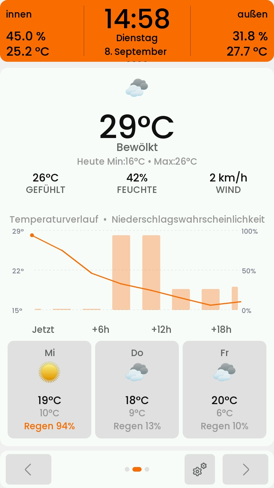
  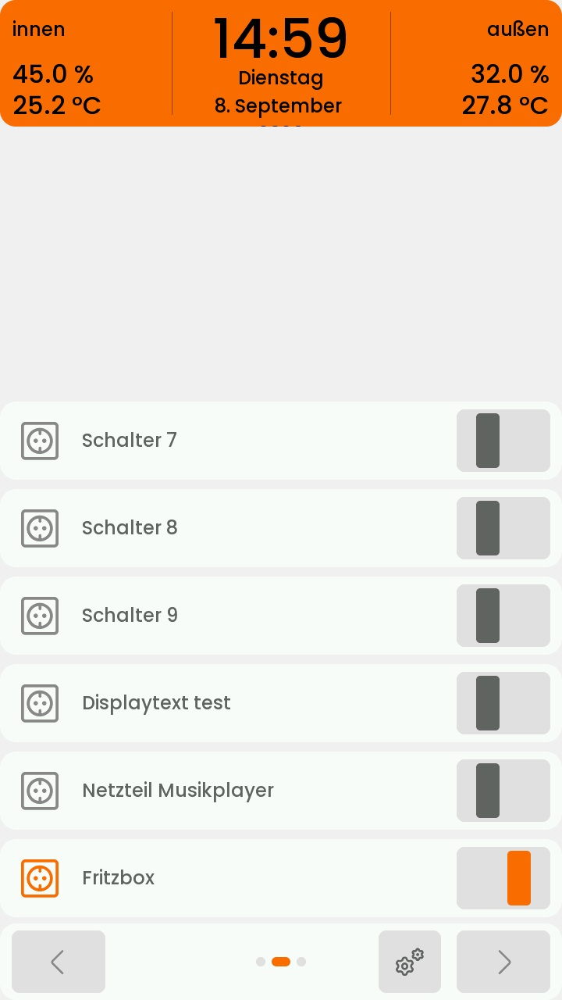
  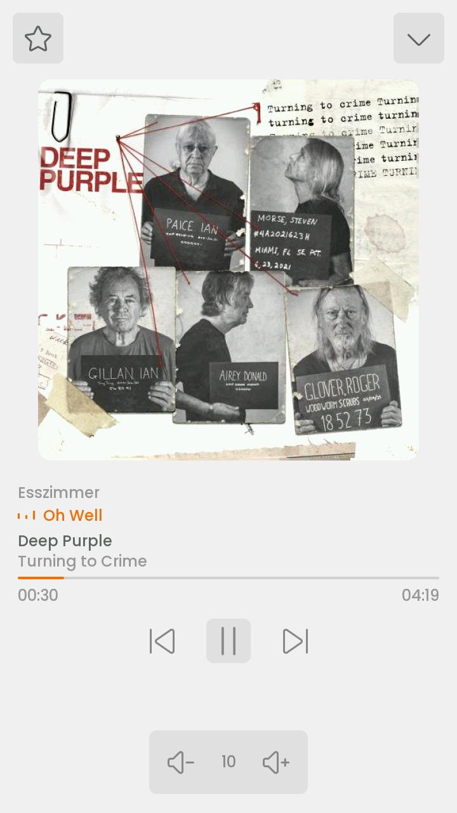

### Web-Konfiguration

Eingerichtet wird das Panel über eine Weboberfläche, die direkt am Gerät
läuft — inklusive visuellem Layout-Editor mit Live-Vorschau und einem
Status-Dashboard mit Echtzeitwerten.

  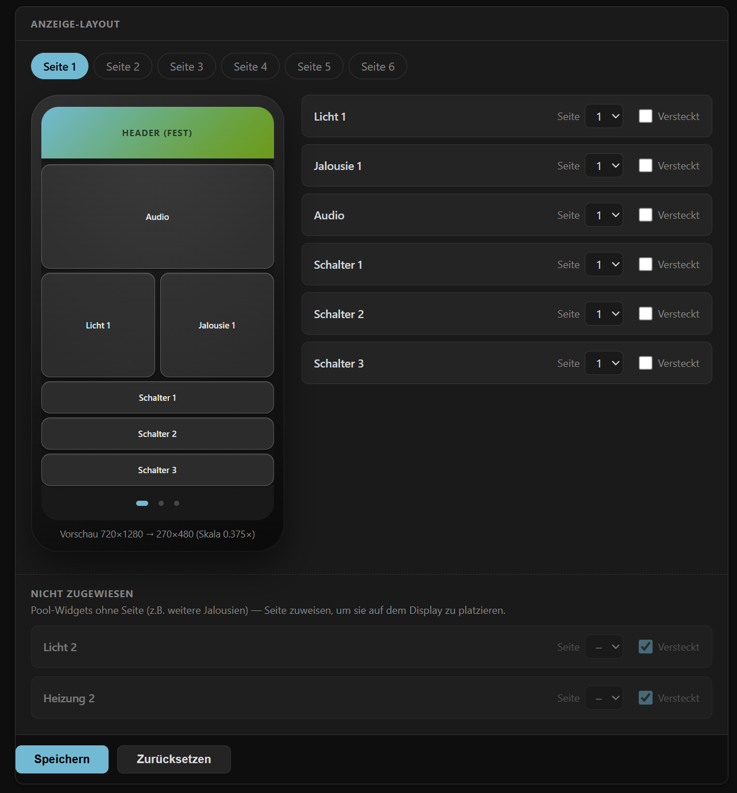
  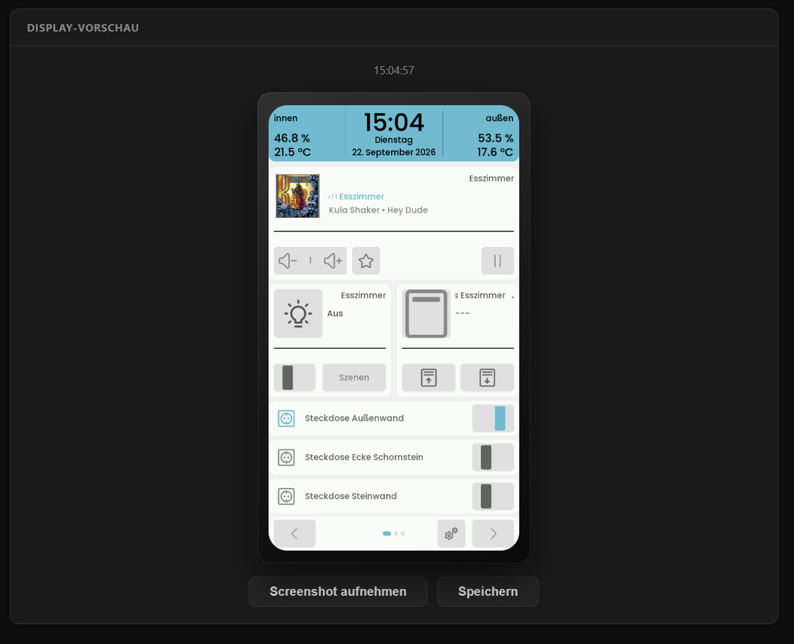
  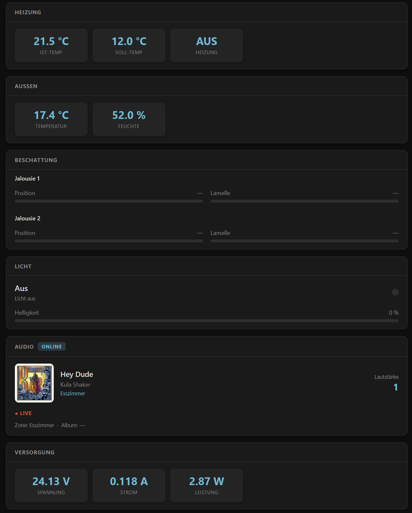
  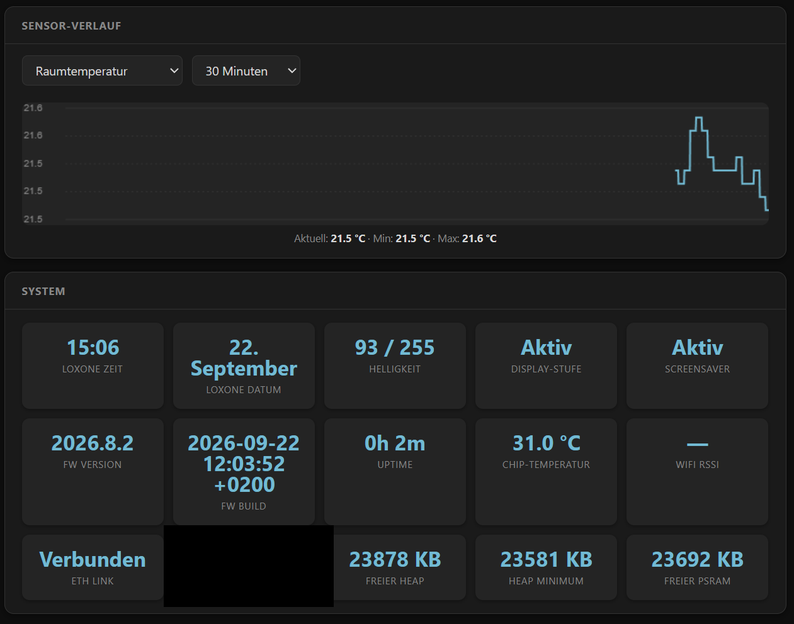

### MiraiBridge (LoxBerry-Plugin)

Die Einrichtung auf LoxBerry-Seite läuft genauso über eine Weboberfläche —
Panels anlegen, Räume aus der Loxone-Struktur zuweisen und die erkannten
Funktionsblöcke pro Raum verknüpfen.

  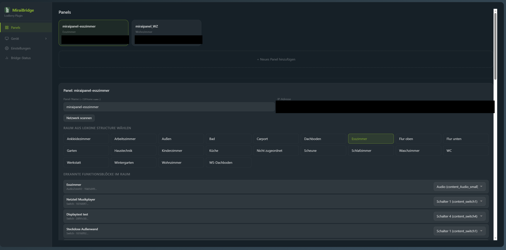
  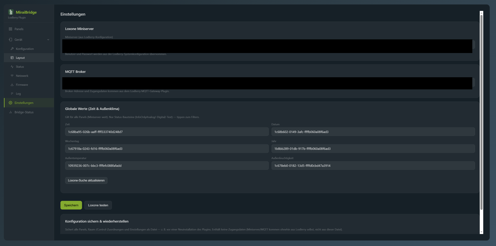

## Verhalten: Screensaver & Sleep

Das Display eskaliert bei Inaktivität in mehreren Stufen, statt einfach
abrupt auszugehen — und kann bei Bedarf per MQTT sogar in echten
Tiefschlaf versetzt werden, aus dem es zyklisch nur kurz für einen
Sensor-Report aufwacht.

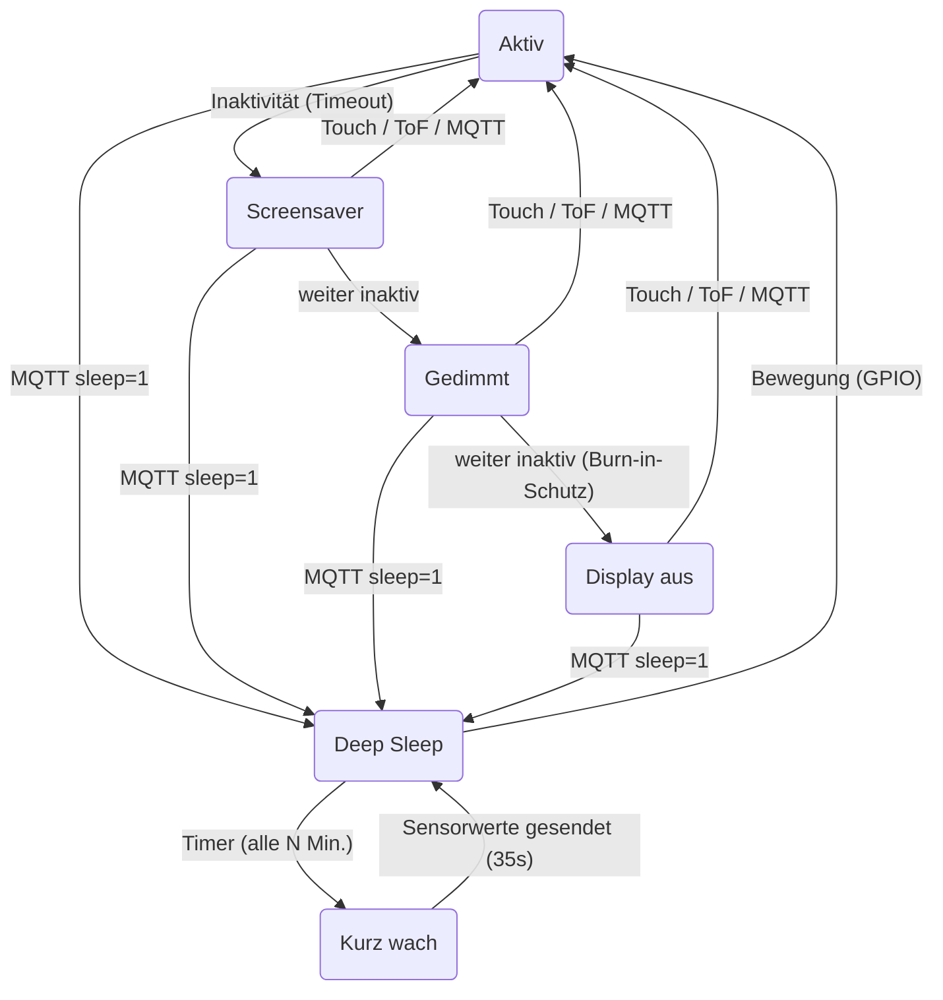

- **Screensaver**: nach konfigurierbarer Inaktivität blendet sich je nach
  Zustand eine Analoguhr (kein Audio aktiv) oder ein Now-Playing-Overlay
  (Musik läuft) ein
- **Dimmen**: Helligkeit sinkt in einer ersten Stufe ab (auf einen festen
  Nachtwert oder relativ zur zuletzt aktiven Helligkeit)
- **Display aus**: zweite Stufe schaltet die Hintergrundbeleuchtung ganz
  ab, ein Burn-in-Schutz läuft dabei unsichtbar im Hintergrund weiter
- **Aufwecken**: durch Touch, Näherungssensor, oder eine MQTT-Helligkeits-
  Änderung von Loxone aus — jede dieser drei Stufen lässt sich so wieder
  verlassen
- **Night Mode / Deep Sleep**: per MQTT-Befehl aktivierbar (z.B. nachts)
  — der ESP32-P4 geht dann in echten Tiefschlaf (< 0,1 W statt ~2,3 W im
  Normalbetrieb) und wacht in einem konfigurierbaren Intervall (Standard
  10 Minuten) nur für wenige Sekunden auf, um aktuelle Sensorwerte an
  Loxone zu melden, bevor er wieder schläft. Bewegung am Panel weckt es
  stattdessen sofort vollständig auf.

  Auch im dunklen, scheinbar "ausgeschalteten" Zustand bleibt das Panel
  damit kein blinder Fleck: Die Raumtemperatur wird weiterhin regelmäßig
  an Loxone gemeldet, statt für Stunden komplett zu verstummen — ein
  ungewöhnlicher Temperaturanstieg (z.B. durch einen beginnenden Brand)
  fällt so auch nachts zeitnah auf, um schnellstmöglich zu reagieren.
  Kein Ersatz für einen zugelassenen Rauchmelder, aber ein sinnvoller
  zusätzlicher Beitrag zur Früherkennung, ganz ohne Mehrverbrauch im
  Wachzustand. Auch Raumtemperaturregler bekommen so zuverlässig
  Livewerte, um weiterhin die aktuelle Raumtemperatur regeln zu können.

## Architektur

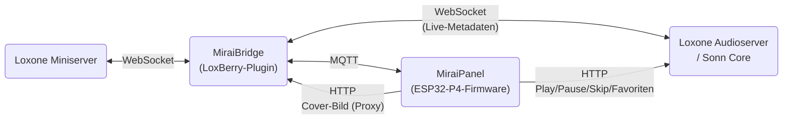

Die MiraiBridge liest beim Start/bei jeder Änderung die komplette
Miniserver-Struktur (`LoxAPP3.json`) und leitet daraus automatisch alle
benötigten MQTT-Topics pro konfiguriertem Baustein ab — keine Topics von
Hand eintragen. Für Audio hält die Bridge zusätzlich eine eigene
WebSocket-Verbindung zum Audioserver/Sonn Core für latenzarme
Titel/Cover/Lautstärke-Updates, die sie per MQTT ans Panel weiterreicht. Nur
für aktive Befehle (Play/Pause/Skip, Favoriten laden) spricht das Panel den
Audioserver direkt per HTTP an, an der Bridge vorbei.

Cover-Bilder holt sich das Panel dagegen über einen kleinen Bild-Proxy in
der MiraiBridge statt direkt von der Original-Quelle: Der Proxy lädt das
Bild, wandelt es unabhängig vom Ausgangsformat (PNG, WebP, auch progressive
JPEGs, an denen der ESP32-Decoder sonst scheitern würde) in ein
kompatibles Baseline-JPEG um, skaliert es auf die jeweils benötigte
Zielgröße und cached das Ergebnis — spart Rechenzeit auf dem Panel und
unnötige wiederholte Downloads derselben Cover-URL.

## Teilprojekte

| Repo | Inhalt |
|---|---|
| [MiraiPanel-LCD](https://github.com/Holzmusik/MiraiPanel-LCD) | Firmware (ESPHome/ESP-IDF) für das ESP32-P4-Panel selbst — Display/LVGL-UI, Sensoren, Touch, Audio, Web-Konfiguration *(Quellcode folgt, noch in Test/Entwicklung)* |
| [LoxBerry-Plugin-MiraiBridge](https://github.com/Holzmusik/LoxBerry-Plugin-MiraiBridge) | "MiraiBridge" — LoxBerry-Plugin, verbindet Loxone Miniserver per MQTT mit dem Panel |
| [MiraiPanel-Hardware](https://github.com/Holzmusik/MiraiPanel-Hardware) | Fertigungsdaten für PCB und Gehäuse (Gerber/STEP/DXF) — noch im Aufbau |

## Hardware

Eigene PCB (Basis + Sensor-/Touch-Module) und Gehäuse, siehe
[MiraiPanel-Hardware](https://github.com/Holzmusik/MiraiPanel-Hardware).
Montage freistehend, wandmontiert, oder nachgerüstet auf dem bestehenden
Sockel eines Lichtschalters (kompakte Variante) — integrierte, unsichtbare
Kabelführung.

  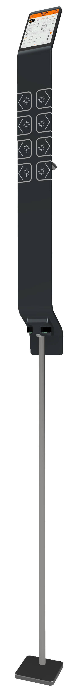
  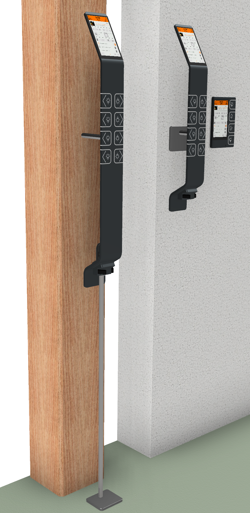

  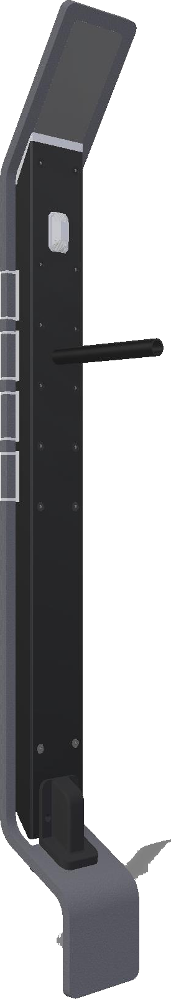

## Technische Daten

| Kategorie | Merkmal | Details |
|---|---|---|
| **Display & Bedienung** | Display | 5,5″ Farb-LCD, Touch, 1280×720 px |
| | Sensortasten | 8× kapazitiv, einstellbare Empfindlichkeit, individuell beschriftbar & pro Raum austauschbar |
| | Näherung | ToF-Sensor + PIR wecken das Display bei Annäherung |
| | Feedback | Tastenklick per Buzzer, zusätzlich per MQTT auslösbarer Dauer-Warnton |
| | UI | Light-/Dark-Theme (auch automatisch über den Lichtsensor), 5 Akzentfarben |
| &nbsp; | | |
| **Sensoren** | Raumklima | Temperatur/Feuchte, CO₂/VOC/Luftqualität |
| | Bewegung | PIR-Sensor |
| | Präsenz | Mikrofon mit einstellbarer Schwelle |
| | Licht | Umgebungslichtsensor |
| | Versorgung | Spannungs-/Strommessung |
| &nbsp; | | |
| **Konnektivität** | Netzwerk | LAN 10/100, automatisches Failover auf WLAN |
| | Protokoll | MQTT — offene Schnittstelle für jede MQTT-Umgebung |
| | Loxone | LoxBerry-Plugin (MiraiBridge) für direkte Integration |
| | Auch nutzbar mit | Home Assistant, ioBroker und jedem MQTT-Broker |
| &nbsp; | | |
| **Stromversorgung** | Versorgung | extern 10–30 V DC, 24 V nominal |
| | Verbrauch | ca. 1,8 W bei aktivem Display |
| | Sleep-Modus | aktivierbar, automatisches Wecken bei aktuellen Sensorwerten, Dauer konfigurierbar |
| &nbsp; | | |
| **Konfiguration** | Einrichtung | vollständig über Web-Oberfläche am Gerät konfigurierbar |
| | Updates | Firmware-Updates over-the-air, Firmware-Datei auch direkt per Drag & Drop im Browser |
| &nbsp; | | |
| **Gehäuse** | Montage | freistehend, wandmontiert, oder nachgerüstet auf bestehendem Lichtschalter-Sockel |
| | Materialien | eloxiertes Aluminium, Edelstahl, 3D-gedrucktes Kunststoff, Glas |

---

MiraiPanel ist ein unabhängiges Projekt und steht in keiner Verbindung
zu oder Unterstützung durch Loxone Electronics GmbH. Loxone ist eine
Marke der Loxone Electronics GmbH.
